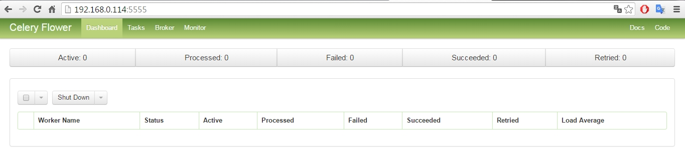
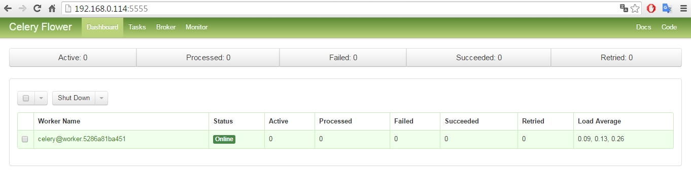
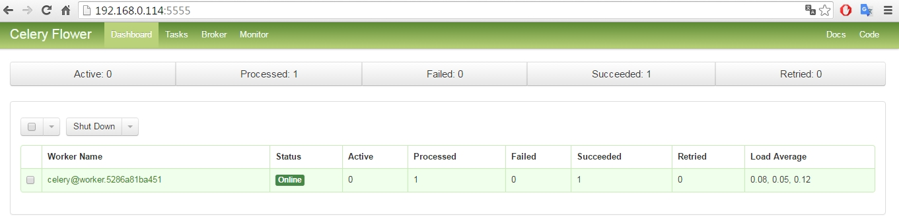
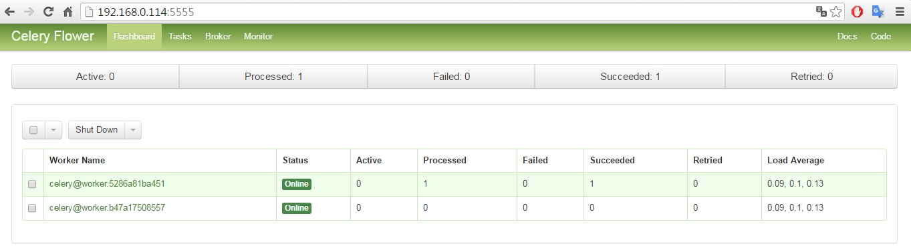
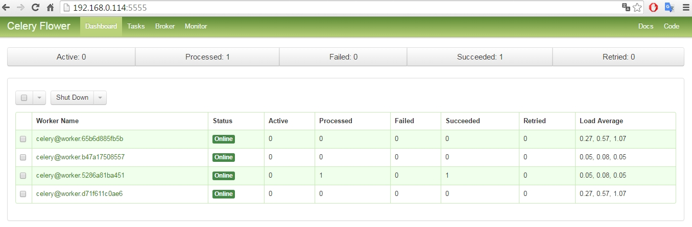
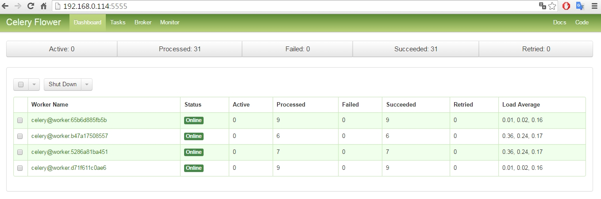

# [One for all, All for one](https://www.youtube.com/watch?v=FcMCd520Ae8)
### [SETI@home](https://en.wikipedia.org/wiki/SETI@home) liked [Volunteer Computing](https://en.wikipedia.org/wiki/Volunteer_computing) on Mixed-Platforms Cluster - using Celery and Docker

Wei Lin  
20160512  

## 緣起   
國外有人建造了這個 [120台 Raspberry Pi (RPi) 組成的 cluster](https://resin.io/blog/what-would-you-do-with-a-120-raspberry-pi-cluster/)，相當於有 **480顆 CPU 核心**，但文章中卻說 "...We're looking for ideas of awesome things we could program for it..."，是否代表他們目前還沒有辦法驅動這120台電腦呢? 抑或只是缺少一個有趣的應用?  
  


不論是什麼狀況，我覺得上圖的 RPi cluster 中似乎有兩件東西不是絕對的必要:  
- 螢幕: 除非是要做電視牆，否則每台 RPi 配一個螢幕似乎不是必要的，而且成本會增加很多。
- 機架: 就功能定義與目的來說，一個 cluster 是指 一群共同完成指定運算的電腦，但是沒有人規定這群電腦必須要架設在同一個機架之上，除非是有 建置成本、管理、行銷 方面的考量。單單考慮功能面，這 120 台 RPi 其實可以散佈在網路上，就算彼此相隔十萬八千里，但只要他們彼此之間協同合作共同完成指定的運算，應該也是屬於同一個 "cluster"。

 如果跳脫 "必須在同一個機架之中" 的思維，其實我們可以很容易地建構一個更大的 cluster。例如，或許可以號召台灣的 RPi 使用者，**請他們把 RPi 就地連上網路，這樣就可以很快地建構出一個nodes數量數倍於上圖的 cluster**，應該是很容易的。  

 但是，要讓這些電腦具有共同的目的才有意義，例如 [SETI@home](https://en.wikipedia.org/wiki/SETI@home) 集合很多電腦的運算能力來共同解決特定的問題。因此，上述的 cluster 要能具有意義，至少需先滿足幾個前提:
- 需要一個機制可以聚合各個電腦的運算能力，即是 需要有一個 distributed parallel computing 的機制。
- 因為參加的電腦來自很多不同的人，參加與退出 cluster 的方式應該要非常簡單，最好是 只需執行單一行指令即可。

 [之前](https://github.com/Wei1234c/CeleryOnDockerSwarm/blob/master/celery_projects/CeleryOnDockerSwarm.md)曾經以兩台 Raspberry Pi 作為基礎建立了 Docker-Swarm，在其上佈署 8 個 Celery worker containers 做 distributed parallel computing 處理 Word-Count 的運算需求。以 Docker containers 作為封裝與承載程式碼的單元，而 Docker-Swarm 作為佈署 containers 的機制，證明 Celery + Docker-Swarm 可以做為分散式平行運算的平台。  
 
 然而，如果要符合上述的兩個前提，則必須要做一些調整:  
- 不可使用 Docker Swarm Manager 來佈署 Celery worker containers: 因為 Swarm Manager 必須要透過 無密碼SSH 來操作，這在所有權各異的 nodes 上是行不通的。
- **單一封裝: 將 Celery tasks 相關的 Python 程式碼、內含 Broker 位置的 config 檔案 一起封裝成一個 Docker image，志願者只需 pull and run 這個 Docker image 就會啟動 Celery worker container，參加 distributed parallel computing 的陣列**。
- 若要退出運算陣列，只需 stop Celery worker container 即可。

更進一步的思考，如果 RPi 可以透過上述的機制，run 一個 Docker image 就可以自由的加入並組成一個巨大的 distributed parallel computing cluster，那麼因為 Docker image 具有 "build once, run anywhere" 的特性，其他平台的電腦 只要能跑 Docker，應該也可以參加這個 cluster 才對。

再者，就算其他的平台電腦不支援 Docker，只要能跑 Python 與 Celery，應該也是可以參加這個 cluster 才對。不過本次實驗先只針對 Docker 的環境做討論，暫不將這類的電腦納入測試對象。

## 實驗前提與目標:
- 不同硬體架構與OS平台的電腦，只要支援 Docker 的機制，可以自由加入或退出運算陣列。
- 本次實驗，使用的 硬體架構與OS平台 包括:
 - HypriotOS on Raspberry Pi v.2
 - Ubuntu on amd64 
- **各式電腦，只要 run 指定的 Docker image 之後，就會自動加入 volunteer-computing 的陣列，貢獻運算力量**。
- 各式電腦，可以 run 不同的 Docker image，參加不同的 volunteer-computing 陣列與 projects。
- 超越 volunteer-computing 單向付出的模式，有權限的使用者也可以下指令發送訊息到 cluster 中要求平行運算，也享用大家分享出來的運算資源。所能做的運算受限於 當初封裝在 Docker image 中的 Python code。
- Cluster 之組成、目的、與功能:
 - 以一台 HypriotOS on Raspberry Pi + 一台 Ubuntu on amd64 建構一個 **Web Crawler Cluster**，接收 股票代號，抓取證交所該個股的日成交資訊。
 - **每台機器中 run 2 個 Celery worker containers，兩台機器中共有 4 個 worker containers**。
 - 以 cluster 之外的 使用者端電腦 (Windows 7 64bits) 對 cluster 發送 task messages。
 - 每個 task message 中包括一個 `get_table(stock_id)` 的指令，接收到訊息的 worker 會去證交所抓取該個股的日成交資訊傳回。
 - **task messages 的運算需求 由 4 個 workers 分攤，平行地處理**。
 - 使用者端電腦 收到每個 task message 的結果之後，自行彙整資料。
- **Web Crawler Cluster 只是一個示範的應用，這個 distributed parallel computing cluster 也可做其他的用途，完全取決於 封裝在 Docker image 中的程式碼**，cluster 中各 nodes 的運作也不一定是 parallel 的，也可以是 distributed concurrent 的模式。

## 實作步驟:

### 建立 Docker image for RPi: 
Celery Worker Dockerfile for ARM v7  
image name: wei1234c/one_for_all_all_for_one_armv7 


```python
# one_for_all_all_for_one_armv7
# Celery Worker Dockerfile
# for ARM v7
# 20160512
 
FROM wei1234c/celery_armv7

MAINTAINER Wei Lin

USER root

RUN	mkdir /celery_projects

WORKDIR /celery_projects

COPY . /celery_projects/
 
RUN	chmod +x /celery_projects/start_workers.sh

USER pi

CMD ["/bin/sh", "/celery_projects/start_workers.sh"]
```

### build Docker image for RPi: 
image name: wei1234c/one_for_all_all_for_one_armv7


```python
HypriotOS: pi@rpi202 in ~
$ docker build -t wei1234c/one_for_all_all_for_one_armv7 /dockerfiles/ARMv7/one_for_all_all_for_one
Sending build context to Docker daemon 9.216 kB
Step 1 : FROM wei1234c/celery_armv7
 ---> 8939b7e5c928
Step 2 : MAINTAINER Wei Lin
 ---> Using cache
 ---> 186c6ea155e8
Step 3 : USER root
 ---> Using cache
 ---> b84c84193d65
Step 4 : RUN mkdir /celery_projects
 ---> Using cache
 ---> fff839303a93
Step 5 : WORKDIR /celery_projects
 ---> Using cache
 ---> 27938d9d6ae8
Step 6 : COPY . /celery_projects/
 ---> c120021c8dc0
Removing intermediate container 5b4421e5472b
Step 7 : RUN chmod +x /celery_projects/start_workers.sh
 ---> Running in f719c550c90d
 ---> efa549c140dd
Removing intermediate container f719c550c90d
Step 8 : USER pi
 ---> Running in 1c7a5587769b
 ---> 427f37517ba9
Removing intermediate container 1c7a5587769b
Step 9 : CMD /bin/sh /celery_projects/start_workers.sh
 ---> Running in ed24629cb0ba
 ---> d7bb6603b6c6
Removing intermediate container ed24629cb0ba
Successfully built d7bb6603b6c6
HypriotOS: pi@rpi202 in ~
$ 
```

### 建立 Docker image for amd64: 
Celery Worker Dockerfile for amd64  
image name: wei1234c/one_for_all_all_for_one


```python
# one_for_all_all_for_one
# Celery Worker Dockerfile
# for amd64
# 20160512
 
FROM ubuntu

MAINTAINER Wei Lin

USER root

# Add user pi
RUN \
	useradd -G adm,sudo,users -s /bin/bash -m pi && \
	echo 'pi:raspberry' | chpasswd


#RUN pip3 install pandas

# Install Python. ____________________________________________________________________________________________
RUN apt-get update && \
    apt-get install -y python3 python3-pip python3-dev python3-numpy python3-scipy python3-matplotlib python3-pandas && \
    apt-get install -y python python-pip python-dev

# Install Celery  ____________________________________________________________________________________________
RUN \
	pip3 install -U celery

RUN \
	pip3 install -U redis

RUN	mkdir /celery_projects
	
WORKDIR /celery_projects

COPY . /celery_projects/
 
RUN	chmod +x /celery_projects/start_workers.sh

USER pi

CMD ["/bin/sh", "/celery_projects/start_workers.sh"]
```

### build Docker image for amd64: 
image name: wei1234c/one_for_all_all_for_one


```python
wei@Wei-Lenovo:~$ docker build -t wei1234c/one_for_all_all_for_one /docker/dockerfiles/amd64/one_for_all_all_for_one
Sending build context to Docker daemon 9.728 kB
Step 1 : FROM ubuntu
 ---> c5f1cf30c96b
Step 2 : MAINTAINER Wei Lin
 ---> Using cache
 ---> 626cc4694d46
Step 3 : USER root
 ---> Using cache
 ---> 9212cedf802b
Step 4 : RUN useradd -G adm,sudo,users -s /bin/bash -m pi &&    echo 'pi:raspberry' | chpasswd
 ---> Using cache
 ---> a237ec2f3a84
Step 5 : RUN apt-get update &&     apt-get install -y python3 python3-pip python3-dev python3-numpy python3-scipy python3-matplotlib python3-pandas &&     apt-get install -y python python-pip python-dev
 ---> Using cache
 ---> f65b7e004075
Step 6 : RUN pip3 install -U celery
 ---> Using cache
 ---> 3764134da5f1
Step 7 : RUN pip3 install -U redis
 ---> Using cache
 ---> 61772207fc08
Step 8 : RUN mkdir /celery_projects
 ---> Using cache
 ---> c68f9dc73b5c
Step 9 : WORKDIR /celery_projects
 ---> Using cache
 ---> b9e490c48b98
Step 10 : COPY . /celery_projects/
 ---> Using cache
 ---> 55e921f0a082
Step 11 : RUN chmod +x /celery_projects/start_workers.sh
 ---> Using cache
 ---> 194e82a97639
Step 12 : USER pi
 ---> Using cache
 ---> 740675730169
Step 13 : CMD /bin/sh /celery_projects/start_workers.sh
 ---> Using cache
 ---> d77e8341bf85
Successfully built d77e8341bf85
wei@Wei-Lenovo:~$
```

### 建立 Celery 所需的 Broker，使用 Redis


```python
HypriotOS: pi@rpi202 in ~
$ docker run -d -p 6379:6379 --name=redis --volume=/data:/data hypriot/rpi-redis
2ee100973b0e1317e7511de0c97b2a29ad02a688f9928c14f347922a4aa3fb5d

HypriotOS: pi@rpi202 in ~
$ docker ps
CONTAINER ID        IMAGE               COMMAND                  CREATED             STATUS              PORTS                    NAMES
2ee100973b0e        hypriot/rpi-redis   "/entrypoint.sh redis"   8 seconds ago       Up 7 seconds        0.0.0.0:6379->6379/tcp   redis
HypriotOS: pi@rpi202 in ~
$
```

### 建立監控用的 [Flower](http://docs.celeryproject.org/en/latest/userguide/monitoring.html#flower-real-time-celery-web-monitor) container


```python
HypriotOS: pi@rpi202 in ~
$ docker run -d -p 5555:5555 --name=flower wei1234c/one_for_all_all_for_one_armv7 /bin/sh -c "cd /celery_projects && celery -A stock flower"
3c6e9e85417b536d07562575711e5f288097ed48d6f12c0129155d01ea746e66

HypriotOS: pi@rpi202 in ~
$ docker ps
CONTAINER ID        IMAGE                                    COMMAND                  CREATED             STATUS              PORTS                    NAMES
3c6e9e85417b        wei1234c/one_for_all_all_for_one_armv7   "/bin/sh -c 'cd /cele"   9 seconds ago       Up 7 seconds        0.0.0.0:5555->5555/tcp   flower
2ee100973b0e        hypriot/rpi-redis                        "/entrypoint.sh redis"   2 hours ago         Up 2 hours          0.0.0.0:6379->6379/tcp   redis
HypriotOS: pi@rpi202 in ~
$
```

### 還沒有啟動任何 worker，所以 Flower 介面中是空的



### 在 RPi 中啟動 Celery worker container
### <font color='red'>志願者 只需在 RPi 上面 run 這個 Docker image，無需作任何其他的動作，即可加入 distributed parallel computing 的陣列，貢獻運算資源。</font>


```python
HypriotOS: pi@rpi202 in ~
$ docker run -d --name=musketeer1 wei1234c/one_for_all_all_for_one_armv7
5286a81ba451b8473ef2b5e3bb965a7b0fc31511e1ed4e368659aece2478e053

HypriotOS: pi@rpi202 in ~
$ docker ps
CONTAINER ID        IMAGE                                    COMMAND                  CREATED             STATUS              PORTS                    NAMES
5286a81ba451        wei1234c/one_for_all_all_for_one_armv7   "/bin/sh /celery_proj"   4 seconds ago       Up 3 seconds        5555/tcp                 musketeer1
3c6e9e85417b        wei1234c/one_for_all_all_for_one_armv7   "/bin/sh -c 'cd /cele"   5 minutes ago       Up 5 minutes        0.0.0.0:5555->5555/tcp   flower
2ee100973b0e        hypriot/rpi-redis                        "/entrypoint.sh redis"   2 hours ago         Up 2 hours          0.0.0.0:6379->6379/tcp   redis
HypriotOS: pi@rpi202 in ~
$
```

### RPi 中的 Celery worker container 啟動之後，Flower 介面中即可看到該 worker，但是目前還沒有接到 task message



### package stock 之下的 tasks.py，內含用來定義 task message 的 get_table 函數


```python
from stock.celery import app

import pandas as pd
from datetime import datetime


def get_url(stock_id, year = datetime.today().year, month = datetime.today().month):
    return 'http://www.twse.com.tw/ch/trading/exchange/STOCK_DAY/genpage/Report{year}{month:02}/{year}{month:02}_F3_1_8_{stock_id}.php?STK_NO={stock_id}&myear={year}&mmon={month:02}'.format(stock_id = stock_id, year = year, month = month)


@app.task
def get_table(stock_id, year = datetime.today().year, month = datetime.today().month):
    
    url = get_url(stock_id, year, month) 
    targetTableIndex = 0
    
    table = pd.read_html(url,
                         attrs = {'border': '0' , 
                                  'width': '598', 
                                  'align': 'center', 
                                  'cellpadding': '0', 
                                  'cellspacing': '1', 
                                  'class': 'board_trad'},
                         header = 1
                        )[targetTableIndex]
    
    table['個股代號'] = stock_id
    table = table.reindex(columns = ['個股代號', '日期', '成交股數', '成交金額', '開盤價', '最高價', '最低價', '收盤價', '漲跌價差', '成交筆數'])
    
    return table.tail(1).values
```


```python
# load stock.tasks，會將 get_table 函數的定義載入
from stock.tasks import * 
import numpy as np
```


```python
# 如果直接呼叫，不傳送 task message 給 Broker
# 直接由 Windows 7 的 PC 在 local 端叫用 get_table 函數
get_table(2356)
```


    array([[2356, '105/05/12', 5614182, 114086911, 20.2, 20.55, 20.1, 20.3,
            -0.1, 3159]], dtype=object)


### 非同步呼叫
**<font color='red'>在 Windows 7 的 PC 上，以 IPython Notebook 透過 Celery 的機制對 cluster 發送 task message，要求 cluster 提供平行運算的服務。  
Windows 7 的 PC 本身並無使用 Docker 機制。</font>**   
get_table.apply_async() 會傳送 task message 給 Broker  
Broker 將 task message 放在 Queue中  
RPi 中的 worker 會到 Queue 中檢出 task 執行之後 傳回結果


```python
# 非同步呼叫，傳送 task message 給 Broker
# Broker 將 task message 放在 Queue中
# RPi 中的 worker 會到 Queue 中檢出 task 執行之後 傳回結果
r = get_table.apply_async(args = [2356])
r.get()
```


    array([[2356, '105/05/12', 5614182, 114086911, 20.2, 20.55, 20.1, 20.3,
            -0.1, 3159]], dtype=object)


### 傳送 task messge 給 Broker 之後，Flower 介面中即可看到紀錄，有一個成功處理的 task。



### 在 RPi 中啟動第二個 Celery worker container


```python
HypriotOS: pi@rpi202 in ~
$ docker run -d --name=musketeer2 wei1234c/one_for_all_all_for_one_armv7
b47a17508557cd48bbb21d48d7ad6b652e492058cf209d1c920a28db361e3568

HypriotOS: pi@rpi202 in ~
$ docker ps
CONTAINER ID        IMAGE                                    COMMAND                  CREATED             STATUS              PORTS                    NAMES
b47a17508557        wei1234c/one_for_all_all_for_one_armv7   "/bin/sh /celery_proj"   4 seconds ago       Up 3 seconds        5555/tcp                 musketeer2
5286a81ba451        wei1234c/one_for_all_all_for_one_armv7   "/bin/sh /celery_proj"   21 minutes ago      Up 21 minutes       5555/tcp                 musketeer1
3c6e9e85417b        wei1234c/one_for_all_all_for_one_armv7   "/bin/sh -c 'cd /cele"   26 minutes ago      Up 26 minutes       0.0.0.0:5555->5555/tcp   flower
2ee100973b0e        hypriot/rpi-redis                        "/entrypoint.sh redis"   3 hours ago         Up 3 hours          0.0.0.0:6379->6379/tcp   redis
HypriotOS: pi@rpi202 in ~
$
```

### Flower 介面中即可看到有兩個 workers



### 在 amd64 的 機器中啟動兩個 Celery worker container


```python
wei@Wei-Lenovo:~$ docker run -d --name=musketeer3 wei1234c/one_for_all_all_for_one
65b6d885fb5bf06f10517c79325d19639446d939a0b2395aada323674e2eb121

wei@Wei-Lenovo:~$ docker run -d --name=musketeer4 wei1234c/one_for_all_all_for_one
d71f611c0ae6123f5139f02b1a5a5936f162259271061e7c256cc06d9b9d2511

wei@Wei-Lenovo:~$ docker ps
CONTAINER ID        IMAGE                              COMMAND                  CREATED              STATUS              PORTS               NAMES
d71f611c0ae6        wei1234c/one_for_all_all_for_one   "/bin/sh /celery_proj"   6 seconds ago        Up 3 seconds                            musketeer4
65b6d885fb5b        wei1234c/one_for_all_all_for_one   "/bin/sh /celery_proj"   About a minute ago   Up About a minute                       musketeer3
wei@Wei-Lenovo:~$
```

### Flower 介面中即可看到有4個 workers，2個在 RPi 中，2個在 amd64的機器中




```python
# 要抓取資料的 個股代號
stocks = [1101, 1102, 1103, 1104, 1108, 1109, 1110, 1201, 1203, 1210, 1213, 1215, 1216, 1217, 1218, 1219, 1220,
          1225, 1227, 1229, 1231, 1232, 1233, 1234, 1235, 1236, 1256, 1702, 1737, 1301]
```


```python
from pandas import DataFrame

# 彙整資料成為 Pandas.DataFrame
def reduce(results):
    data = []
    for result in results: data.append(result[0])
        
    table = DataFrame(list(data), 
                      columns = ['個股代號', '日期', '成交股數', '成交金額', '開盤價', '最高價', '最低價', '收盤價', '漲跌價差', '成交筆數'])

    return table     
```


```python
def get_stock_prices(stocks):
    
    # 發送給 Celery 執行
    asyncResults = [get_table.apply_async(args = [stock]) for stock in stocks] 
    
    # 向 AsyncResults 索取結果，並集結成 list
    results = [asyncResult.get() for asyncResult in asyncResults if asyncResult.get() is not None]

    return reduce(results)  

%time prices = get_stock_prices(stocks)
prices[:5]
```

    Wall time: 19.2 s
    


<div>
<table border="1" class="dataframe">
  <thead>
    <tr style="text-align: right;">
      <th></th>
      <th>個股代號</th>
      <th>日期</th>
      <th>成交股數</th>
      <th>成交金額</th>
      <th>開盤價</th>
      <th>最高價</th>
      <th>最低價</th>
      <th>收盤價</th>
      <th>漲跌價差</th>
      <th>成交筆數</th>
    </tr>
  </thead>
  <tbody>
    <tr>
      <th>0</th>
      <td>1101</td>
      <td>105/05/12</td>
      <td>3242925</td>
      <td>96161650</td>
      <td>29.50</td>
      <td>29.80</td>
      <td>29.45</td>
      <td>29.70</td>
      <td>0.05</td>
      <td>2064</td>
    </tr>
    <tr>
      <th>1</th>
      <td>1102</td>
      <td>105/05/12</td>
      <td>3094327</td>
      <td>80204709</td>
      <td>25.60</td>
      <td>26.30</td>
      <td>25.55</td>
      <td>26.00</td>
      <td>0.40</td>
      <td>2046</td>
    </tr>
    <tr>
      <th>2</th>
      <td>1103</td>
      <td>105/05/12</td>
      <td>56511</td>
      <td>492804</td>
      <td>8.78</td>
      <td>8.78</td>
      <td>8.70</td>
      <td>8.74</td>
      <td>-0.04</td>
      <td>32</td>
    </tr>
    <tr>
      <th>3</th>
      <td>1104</td>
      <td>105/05/12</td>
      <td>138794</td>
      <td>2766347</td>
      <td>20.15</td>
      <td>20.15</td>
      <td>19.85</td>
      <td>20.00</td>
      <td>-0.15</td>
      <td>85</td>
    </tr>
    <tr>
      <th>4</th>
      <td>1108</td>
      <td>105/05/12</td>
      <td>85995</td>
      <td>865446</td>
      <td>10.05</td>
      <td>10.10</td>
      <td>10.00</td>
      <td>10.05</td>
      <td>0.00</td>
      <td>43</td>
    </tr>
  </tbody>
</table>
</div>


```python
# 抓回來的資料，全部
prices
```


<div>
<table border="1" class="dataframe">
  <thead>
    <tr style="text-align: right;">
      <th></th>
      <th>個股代號</th>
      <th>日期</th>
      <th>成交股數</th>
      <th>成交金額</th>
      <th>開盤價</th>
      <th>最高價</th>
      <th>最低價</th>
      <th>收盤價</th>
      <th>漲跌價差</th>
      <th>成交筆數</th>
    </tr>
  </thead>
  <tbody>
    <tr>
      <th>0</th>
      <td>1101</td>
      <td>105/05/12</td>
      <td>3242925</td>
      <td>96161650</td>
      <td>29.50</td>
      <td>29.80</td>
      <td>29.45</td>
      <td>29.70</td>
      <td>0.05</td>
      <td>2064</td>
    </tr>
    <tr>
      <th>1</th>
      <td>1102</td>
      <td>105/05/12</td>
      <td>3094327</td>
      <td>80204709</td>
      <td>25.60</td>
      <td>26.30</td>
      <td>25.55</td>
      <td>26.00</td>
      <td>0.40</td>
      <td>2046</td>
    </tr>
    <tr>
      <th>2</th>
      <td>1103</td>
      <td>105/05/12</td>
      <td>56511</td>
      <td>492804</td>
      <td>8.78</td>
      <td>8.78</td>
      <td>8.70</td>
      <td>8.74</td>
      <td>-0.04</td>
      <td>32</td>
    </tr>
    <tr>
      <th>3</th>
      <td>1104</td>
      <td>105/05/12</td>
      <td>138794</td>
      <td>2766347</td>
      <td>20.15</td>
      <td>20.15</td>
      <td>19.85</td>
      <td>20.00</td>
      <td>-0.15</td>
      <td>85</td>
    </tr>
    <tr>
      <th>4</th>
      <td>1108</td>
      <td>105/05/12</td>
      <td>85995</td>
      <td>865446</td>
      <td>10.05</td>
      <td>10.10</td>
      <td>10.00</td>
      <td>10.05</td>
      <td>0.00</td>
      <td>43</td>
    </tr>
    <tr>
      <th>5</th>
      <td>1109</td>
      <td>105/05/12</td>
      <td>4000</td>
      <td>40050</td>
      <td>10.05</td>
      <td>10.05</td>
      <td>10.00</td>
      <td>10.00</td>
      <td>0.00</td>
      <td>4</td>
    </tr>
    <tr>
      <th>6</th>
      <td>1110</td>
      <td>105/05/12</td>
      <td>31000</td>
      <td>445500</td>
      <td>14.20</td>
      <td>14.45</td>
      <td>14.20</td>
      <td>14.45</td>
      <td>0.00</td>
      <td>13</td>
    </tr>
    <tr>
      <th>7</th>
      <td>1201</td>
      <td>105/05/12</td>
      <td>1015742</td>
      <td>19595770</td>
      <td>19.65</td>
      <td>19.70</td>
      <td>19.00</td>
      <td>19.10</td>
      <td>-0.60</td>
      <td>384</td>
    </tr>
    <tr>
      <th>8</th>
      <td>1203</td>
      <td>105/05/12</td>
      <td>12004</td>
      <td>257184</td>
      <td>21.55</td>
      <td>21.55</td>
      <td>21.40</td>
      <td>21.40</td>
      <td>-0.30</td>
      <td>11</td>
    </tr>
    <tr>
      <th>9</th>
      <td>1210</td>
      <td>105/05/12</td>
      <td>4576158</td>
      <td>107022964</td>
      <td>23.05</td>
      <td>23.75</td>
      <td>23.00</td>
      <td>23.40</td>
      <td>0.50</td>
      <td>1946</td>
    </tr>
    <tr>
      <th>10</th>
      <td>1213</td>
      <td>105/05/12</td>
      <td>26010</td>
      <td>447070</td>
      <td>17.30</td>
      <td>17.30</td>
      <td>17.15</td>
      <td>17.15</td>
      <td>-0.10</td>
      <td>21</td>
    </tr>
    <tr>
      <th>11</th>
      <td>1215</td>
      <td>105/05/12</td>
      <td>4658698</td>
      <td>135637699</td>
      <td>28.65</td>
      <td>29.40</td>
      <td>28.65</td>
      <td>28.95</td>
      <td>0.25</td>
      <td>1992</td>
    </tr>
    <tr>
      <th>12</th>
      <td>1216</td>
      <td>105/05/12</td>
      <td>5823532</td>
      <td>337920756</td>
      <td>57.30</td>
      <td>58.50</td>
      <td>57.30</td>
      <td>58.40</td>
      <td>1.10</td>
      <td>2945</td>
    </tr>
    <tr>
      <th>13</th>
      <td>1217</td>
      <td>105/05/12</td>
      <td>430450</td>
      <td>3402141</td>
      <td>7.85</td>
      <td>8.00</td>
      <td>7.81</td>
      <td>7.85</td>
      <td>0.00</td>
      <td>173</td>
    </tr>
    <tr>
      <th>14</th>
      <td>1218</td>
      <td>105/05/12</td>
      <td>268733</td>
      <td>3345762</td>
      <td>12.45</td>
      <td>12.55</td>
      <td>12.35</td>
      <td>12.40</td>
      <td>-0.15</td>
      <td>106</td>
    </tr>
    <tr>
      <th>15</th>
      <td>1219</td>
      <td>105/05/12</td>
      <td>37208</td>
      <td>562998</td>
      <td>15.20</td>
      <td>15.20</td>
      <td>15.00</td>
      <td>15.05</td>
      <td>-0.15</td>
      <td>17</td>
    </tr>
    <tr>
      <th>16</th>
      <td>1220</td>
      <td>105/05/12</td>
      <td>50000</td>
      <td>519600</td>
      <td>10.45</td>
      <td>10.50</td>
      <td>10.30</td>
      <td>10.45</td>
      <td>0.00</td>
      <td>25</td>
    </tr>
    <tr>
      <th>17</th>
      <td>1225</td>
      <td>105/05/12</td>
      <td>55382</td>
      <td>1757142</td>
      <td>31.65</td>
      <td>31.90</td>
      <td>31.20</td>
      <td>31.20</td>
      <td>-0.45</td>
      <td>19</td>
    </tr>
    <tr>
      <th>18</th>
      <td>1227</td>
      <td>105/05/12</td>
      <td>511892</td>
      <td>39680787</td>
      <td>77.50</td>
      <td>77.80</td>
      <td>77.20</td>
      <td>77.60</td>
      <td>-0.10</td>
      <td>401</td>
    </tr>
    <tr>
      <th>19</th>
      <td>1229</td>
      <td>105/05/12</td>
      <td>354427</td>
      <td>7157504</td>
      <td>20.40</td>
      <td>20.40</td>
      <td>20.05</td>
      <td>20.10</td>
      <td>0.10</td>
      <td>183</td>
    </tr>
    <tr>
      <th>20</th>
      <td>1231</td>
      <td>105/05/12</td>
      <td>619161</td>
      <td>18610131</td>
      <td>29.25</td>
      <td>30.55</td>
      <td>29.25</td>
      <td>30.20</td>
      <td>1.05</td>
      <td>328</td>
    </tr>
    <tr>
      <th>21</th>
      <td>1232</td>
      <td>105/05/12</td>
      <td>118000</td>
      <td>9158100</td>
      <td>77.30</td>
      <td>77.90</td>
      <td>77.30</td>
      <td>77.40</td>
      <td>0.10</td>
      <td>55</td>
    </tr>
    <tr>
      <th>22</th>
      <td>1233</td>
      <td>105/05/12</td>
      <td>62200</td>
      <td>2293460</td>
      <td>36.80</td>
      <td>37.05</td>
      <td>36.80</td>
      <td>36.85</td>
      <td>0.05</td>
      <td>32</td>
    </tr>
    <tr>
      <th>23</th>
      <td>1234</td>
      <td>105/05/12</td>
      <td>207595</td>
      <td>6888635</td>
      <td>33.60</td>
      <td>33.60</td>
      <td>32.95</td>
      <td>32.95</td>
      <td>-0.95</td>
      <td>107</td>
    </tr>
    <tr>
      <th>24</th>
      <td>1235</td>
      <td>105/05/12</td>
      <td>25160</td>
      <td>595842</td>
      <td>23.45</td>
      <td>23.95</td>
      <td>23.30</td>
      <td>23.90</td>
      <td>0.00</td>
      <td>23</td>
    </tr>
    <tr>
      <th>25</th>
      <td>1236</td>
      <td>105/05/12</td>
      <td>18010</td>
      <td>361551</td>
      <td>20.15</td>
      <td>20.15</td>
      <td>20.00</td>
      <td>20.00</td>
      <td>-0.15</td>
      <td>16</td>
    </tr>
    <tr>
      <th>26</th>
      <td>1256</td>
      <td>105/05/12</td>
      <td>13150</td>
      <td>1573200</td>
      <td>120.00</td>
      <td>120.00</td>
      <td>118.50</td>
      <td>118.50</td>
      <td>-2.50</td>
      <td>13</td>
    </tr>
    <tr>
      <th>27</th>
      <td>1702</td>
      <td>105/05/12</td>
      <td>1020054</td>
      <td>63916873</td>
      <td>61.70</td>
      <td>63.20</td>
      <td>61.70</td>
      <td>62.60</td>
      <td>0.60</td>
      <td>601</td>
    </tr>
    <tr>
      <th>28</th>
      <td>1737</td>
      <td>105/05/12</td>
      <td>207912</td>
      <td>5610143</td>
      <td>27.00</td>
      <td>27.10</td>
      <td>26.85</td>
      <td>26.85</td>
      <td>-0.10</td>
      <td>97</td>
    </tr>
    <tr>
      <th>29</th>
      <td>1301</td>
      <td>105/05/12</td>
      <td>3896203</td>
      <td>300815138</td>
      <td>77.00</td>
      <td>77.40</td>
      <td>76.80</td>
      <td>77.10</td>
      <td>0.10</td>
      <td>2088</td>
    </tr>
  </tbody>
</table>
</div>


```python
len(prices)
# 共抓取 30筆股價資料，加上一開始測試的 1 筆，所以 Flower 介面中顯示總共成功處理過 31 次任務。
```


    30


### Flower 介面中即可看到: 4個 workers，2個在 RPi 中，2個在 amd64的機器中， 都有出一份心力抓取資料



## Summary:

 [SETI@home](https://en.wikipedia.org/wiki/SETI@home) 集合很多電腦的運算能力來共同解決特定的問題，是一個代表性的典範，但年代已久。  
 
 而現今 藉由 Celery 與 Docker 的機制，我們可以讓電腦只需 pull and run 一個 Docker image，即可加入 distributed parallel computing 的 cluster，貢獻一己的運算資源，不論電腦的大小與CPU架構的種類。
 
 本實驗中，我們使用一台 Raspberry Pi 和 一台 amd64架構 的 PC 來建構 **Web Crawler Cluster**，採用 distributed parallel computing 的模式，接受工作的委託，依據股票代號，抓取證交所網站中 個股的當日成交資訊。  
 
 超越 volunteer-computing 單向付出的模式，有權限的使用者也可以下指令發送訊息到 cluster 中要求平行運算的服務，享用大家分享出來的運算資源。
 
 [120台 Raspberry Pi 組成的 cluster](https://resin.io/blog/what-would-you-do-with-a-120-raspberry-pi-cluster/) 乍看不小，但如果可以跳脫 "必須在同一個機架之中" 的思維，其實我們可以很容易地建構一個更大的 cluster，參加的 RPi 或者 PC 只需就地連上網路，run 指定的 Docker image，這樣就可以很快地建構出一個nodes數量相當大的 cluster。
